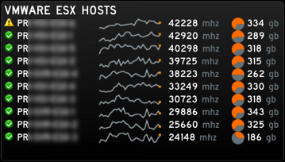
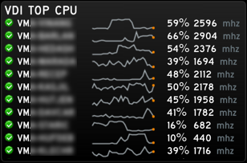
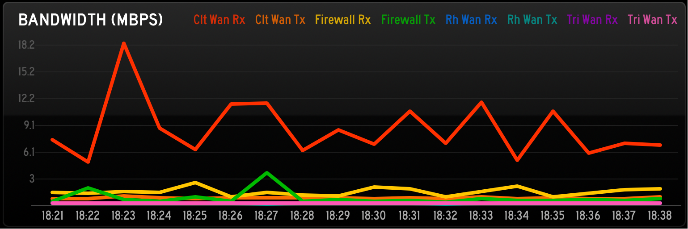
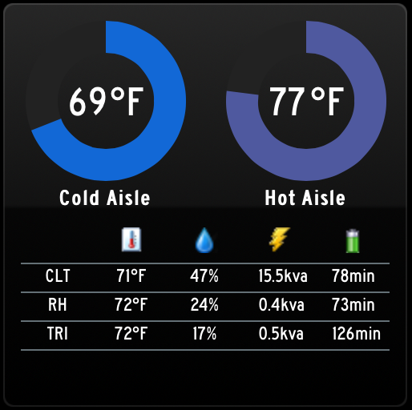
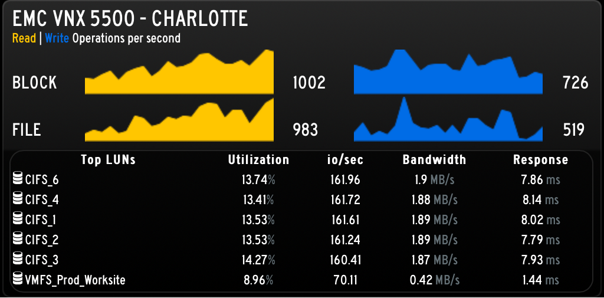

SysAdminBoard
=======================

SysAdminBoard is a collection of DIY panels and data generators for the [Panic StatusBoard iPad App](http://www.panic.com/statusboard/) designed to display data relevant to Sysadmins.  Code is written in Python, HTML and Javascript and served on a simple [CherryPy Webserver](http://cherrypy.org/) (included).

This project is not intended to be a ready-to-deploy solution.  However, if you are comfortable with Python, you should be able to get this working without much effort.

##Features
###VMware vSphere ESX Host Monitoring

This code will talk to a VMware vSphere vCenter server using VMware APIs to get data about ESX hosts.  Items are sorted based on top CPU usage over a 30 minute period.
###VMware vSphere VM Monitoring

This code will talk to a VMware vSphere vCenter server using VMware APIs to get data about the top ESX VMs.  Items are sorted based on top CPU usage over a 30 minute period.
###SNMP Network Monitoring

This code generates JSON data only that is consumed by the Statusboard iPad app's built in graph function.
###SNMP Temperature Gadget

This code talks to a couple different APC devices to pull in temperature, humidity, voltage and runtime data.
###EMC VNX Monitoring

This code talks to an EMC VNX Reporting and Monitoring web server to pull down performance data.  There is probably a better way to do this, but I was in a hurry.

## Code Layout
Individual python files are designed to be run independently for testing.  You can run any of the python files directly and it will output data in JSON format.  (Personally, I recommend loading it up in the [PyCharm](http://www.jetbrains.com/pycharm/) debugger).  

You will need to edit the files to provide your server addresses and credentials.  Although the python files are hidden behind the web server, the credentials are being stored in plain text, so be sure that you are using restricted accounts.  For example, a read-only VMware vSphere account is all we need.

The static HTML pages are loaded by the Statusboard iPad App which then uses AJAX to retrieve the JSON data.  You will need to edit each HTML file to replace the name of the server where the AJAX function will grab the JSON data (search and replace http://sysadminboard.yourcompany.com/).  *Keep in mind that Javascript security causes failures if you try to load the HTML and AJAX/JSON from different webservers.*

The main function here is the webserver.py. This launches the CherryPy webserver and loads each data generator into a separate thread.  The webserver code has 4 distinct sections that you'll need to edit according to which modules you want to run.

1. The Class MyWebServer object defines the URL aliases for the web server.  Each gadget has 2 URLs, one that loads the HTML and another that the HTML javascript calls to get the JSON data.
2. The Callback Functions section creates a function for each data module and calls its generate_json() function.
3. The Register Callback Functions section is where we register each of the Callback Functions with CherryPy (so they'll each be run in their own thread).
4. The final section starts the webserver.

You can test the individual HTML pages in any web browser (the integrated Firefox or Chrome javascript debuggers are great).  Since the StatusBoard iPad app requires white fonts on a white background, it can be difficult to see the output correctly.  If you load the page with this URL:  (yourwebserver.com/static/vmhost.html?desktop), it will change the background to black for easy testing.

## Simple Linux Configuration
Here are some directions for a base CentOS Linux server install.

Install setuptools and pip
```
curl https://raw.github.com/pypa/pip/master/contrib/get-pip.py | python -
```

Install required Python modules for the statusboard code.
```
pip install CherryPy
pip install -U pysphere
pip install mechanize
pip install mysql-connector-python
```

Install pysnmp
```
yum groupinstall "Development Tools"
yum install python-devel
wget https://bitbucket.org/pypa/setuptools/raw/bootstrap/ez_setup.py 
python ez_setup.py 
easy_install pysnmp
```

Setup Service
There is a simple init.d script in the source init.d directory.  Copy the sysadminboard  file to /etc/init.d/sysadminboard on server.  Copy all of my files into /opt/sysadminboard, create a user and group called sbpython, change ownership of all files to sbpython.  (The Webserver process will run as sbpython).
```
chmod +x /etc/init.d/sysadminboard
chkconfig sysadminboard on
chown -R sbpython:sbpython /opt/sysadminboard
```

With the init file in place, you can run the following commands (and it will load on startup):
```
service sysadminboard start
service sysadminboard stop
service sysadminboard status
service sysadminboard restart
```

Add these rules to your firewall to redirect from port 8080 to port 80:
```
 iptables -A INPUT -p tcp --dport 80 -j ACCEPT 
 iptables -A INPUT -p tcp --dport 8080 -j ACCEPT 
# Redirect port 80 to port 8080
 iptables -t nat -A PREROUTING -p tcp -m tcp --dport 80 -j REDIRECT --to-ports 8080
```


##To Do
Here's a quick list of improvements I'd like to make to the system when I have time.
* Replace static HTML code with Templating system (Mako, Genshi or something else).  *Currently HTML tables are manually edited to match the expected output*
* Move login credentials and variables to a single location
* Improve/Simplify webserver.py to make maintenance and adding new modules easier


##Links to Projects used here
* [JQuery](http://jquery.com/)
* [JQueryUI](http://jqueryui.com/)
* [Easy Pie Chart](http://rendro.github.io/easy-pie-chart/)
* [jQuery Sparklines](http://omnipotent.net/jquery.sparkline/#s-about)
* [PySNMP](http://pysnmp.sourceforge.net)
* [PySphere](https://code.google.com/p/pysphere/)
* [CherryPy](http://www.cherrypy.org/)
