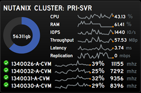

SysAdminBoard
=======================

SysAdminBoard is a simple dashboard system written in Python, HTML and Javascript and served on a simple [CherryPy Webserver](http://cherrypy.org/) (included).  It was originally written to reformat snmp data for the [Panic Statusboard iPad App](http://www.panic.com/Statusboard/), but has since become a fully stand-alone project that can grab data from a variety of sources and render charts and graphs in a web browser.

Here is an older photo our installation.  We use some small ASUS chromeboxes along with the [Chrome Kiosk extension](https://chrome.google.com/webstore/detail/kiosk/afhcomalholahplbjhnmahkoekoijban?hl=en) to display our dashboards.


##Features
###VMware vSphere ESX Host Monitoring
This module will talk to a VMware vSphere vCenter server using VMware APIs to get data about ESX hosts.  Items are sorted based on top CPU usage over a 30 minute period.


###VMware vSphere VM Monitoring
This module will talk to a VMware vSphere vCenter server using VMware APIs to get data about the top ESX VMs.  Items are sorted based on top CPU usage over a 30 minute period.


###Network Bandwidth Monitoring

This module demonstrates how to grab network bandwidth data.  In the first image, it is pulling in snmp data from a Palo Alto Firewall.  In the second image, it is pulling snmp data some VLANs on a Cisco Catalyst 6880 switch.


###SNMP Network Monitoring

This module demonstrates how to grab SNMP table data.  In this case, it is pulling in ISDN values from a Cisco Voice Gateway to show the number of active phone calls.


###SNMP Temperature Gadget

This module talks to a couple different APC devices to pull in temperature, humidity, voltage and runtime data.


###Exchange Monitoring

This module monitors a Microsoft Exchange server to display SMTP message totals for the day along with RPC and latency information (per CAS server).  Note that this code requires my [pyPerfmon](https://github.com/flakshack/pyPerfmon) app running on each Exchange server to be monitored.


###Tintri Monitoring

This module monitors a Tintri hybrid storage device using REST API calls.


###Rubrik Monitoring

This module monitors a Rubrik backup system using REST API calls.


###Nutanix Monitoring

This module monitors a Nutanix hyperconverged system using REST API calls.  The first image shows cluster monitoring.



The second Nutanix gadget shows per-VM storage monitoring.  It shows the top X VMs in the cluster sorted by IOPS based over a 30 minute window.


###Weather

This is a simple javascript-only weather gadget that pulls data from [OpenWeatherMap.org](http://openweathermap.org).  If you use this gadget, please sign up for a free APPID on that site and edit the source file to include your code.


###Clock

This is a great javascript-only clock from [YXKFW](http://www.yxkfw.com/?p=15718).


###Twitter


## Code Layout
This project is basically a copy of what I run in production.  You will need to edit the data module files to provide details related to your environment, for example server ip addresses and SNMP OIDs.  You will want to download a copy of the free [PyCharm Community Edition](https://www.jetbrains.com/pycharm/) so you can step through modules as necessary to get them working in your environment.

Each data module in the system is a single python file designed to be run independently for testing.  You can run any of the python files directly and it will output data in JSON format.  When launched via the main webserver module, these data modules provide JSON data to HTML/javascript front-end pages.

You should edit the credentials.py file to store usernames and passwords.  Although the python files are hidden behind the web server, the credentials are being stored in plain text, so be sure that you are using locked down accounts with read-only privileges.  For example, a read-only VMware vSphere account is all we need.

The main module is webserver.py. This launches the CherryPy webserver and loads each data module into a separate thread.  To enable/disable a module, find the **MODULES** section and use the SysAdminBoardModule function, specifying the module filename (without the .py).  

For example this function:
```
SysAdminBoardModule('vmware_host')
```
will load the vmware_host.py data module, setup the webserver to serve the front-end HTML page (/vmware_host) and serve the json data (/vmware_host/ajax).  By default, the webserver only has the sample module enabled.

If you browse to the webserver, it will display a list of loaded modules with links to display the output appropriately (HTML and AJAX).  Note that the webserver loads on port 8080 by default unless you make the iptables changes below to redirect from port 80.

## Simple Linux Configuration
Here are some directions for a base CentOS 6 Linux server install.  (Note that these directions were updated and simplified on 12/21/2016 to account for the upgrade to Python3).

Install Python3 (note that gcc and python34-devel are required for pysnmp)

```
yum install epel-release
yum install python34 python-pip python34-devel gcc
```

Create a virtual environment in /opt/sysadminboard-ve to store the required python modules (so they don't intermingle with the normal OS python modules.)

```
pip install -U pip
pip install virtualenv
cd /opt
virtualenv -p python3 sysadminboard-ve
```

Now that the virtual environment is available, use this command anytime you want to test or run pip

```
source /opt/sysadminboard-ve/bin/activate
```

Confirm which python you're using

```
which python
```

Install modules using pip  (make sure you're in the virtualenv first using the source command above.)

```
pip install CherryPy
pip install routes
pip install pyvmomi
pip install mysql-connector
pip install requests
pip install pysnmp
```

Copy all files to /opt/sysadminboard.  Note that the default log_settings.json file is set for debugging on Mac OS X.  Replace it with the CentOS version in log_settings_samples.

Create sbpython account and assign owner rights to the static folder.  The webserver will run as this user account, so it needs rights to this folder.  All other files will be owned by root.  Be sure to mark the credentials file so other accounts cannot access it.

```
adduser sbpython
chown -R sbpython:sbpython /opt/sysadminboard/static
chmod 700 /opt/sysadminboard/credentials.py
```

There are sample syslog and logrotate files that you can copy to your system to facilitate logging.

```
cp /opt/sysadminboard/centos_install/rsyslog.d/sysadminboard.conf /etc/rsyslog.d
service rsyslog restart
cp /opt/sysadminboard/centos_install/logrotate.d/sysadminboard /etc/logrotate.d
```

Setup Service
There is a simple init.d script in the source init.d directory.  Copy the sysadminboard file to /etc/init.d/ on server

```
cp /opt/sysadminboard/centos_install/init.d/sysadminboard /etc/init.d
chmod +x /etc/init.d/sysadminboard
chkconfig sysadminboard on
```

You can run the following commands now to stop or start the service.

```
service sysadminboard start
service sysadminboard stop
service sysadminboard status
```

Note that you use the deactivate command to exit a virtual environment.  The source...activate and deactivate commands are not needed when starting the service, only when testing.

```
deactivate
```


Add these rules to your firewall to redirect from port 8080 to port 80:

```
 iptables -A INPUT -p tcp --dport 80 -j ACCEPT
 iptables -A INPUT -p tcp --dport 8080 -j ACCEPT
# Redirect port 80 to port 8080
 iptables -t nat -A PREROUTING -p tcp -m tcp --dport 80 -j REDIRECT --to-ports 8080
```


##Major Change Log
2016-12-21
* Changed python support to Python3.  Python2.x no longer supported.
* Changed vmware access method from pysphere to pyvmomi (official VMware sdk)
* Added logging support and improved error handling
* Added Nutanix gadgets
* Resolved issues with Rubrik API behavior
* Updated readme.md to include new build directions (including virtualenv for Python3).
* Now including copies of all the modules and dashboards that I'm running in production.
* Retired the VNX modules.

2016-09-21
* New Rubrik gadget

2015-02-08
* New HTML pages to graph data normally handled by Statusboard iPad app using Chartjs.
* Updated HTML to use a shared CSS file.
* Updated HTML to move to jquery 2.
* New VNX Storage Pool IOPS data generator.
* New HTML weather gadget.
* New HTML clock gadget.
* New HTML twitter gadget.
* New Dashboard.html file that will load other pages in an iFrame.
* Updated javascript error handling. Other minor javascript tweaks.


2014-09-09
* Credentials are now stored in a single file.
* Webserver.py has been simplified to avoid repeated code.  
	* Modules are now enabled/disabled by a single line: *SysAdminBoardModule('somemodulename')* which automatically imports the python file, adds the necessary entries to the webserver and sets up the process threads.  
	* .HTML files have been renamed to match the associated .PY module.  
	* URLs have also changed to match the module name.  http://server/module and http://server/module/ajax
	* Note that these changes require 2 new python modules (shown above: importlib and routes)
* Browsing to the root of the web site now displays links for all loaded modules (HTML and AJAX).
* A new sample module is included and is the only module enabled by default.
* New Tintri (REST API) monitoring gadget.
* Fixed HTML error handling (so pages will appear blank when the server is not responsive).
* HTML javascript updated to avoid hardcoded servername references.


##Links to Projects used here
* [JQuery](http://jquery.com/)
* [JQueryUI](http://jqueryui.com/)
* [Easy Pie Chart](http://rendro.github.io/easy-pie-chart/)
* [jQuery Sparklines](http://omnipotent.net/jquery.sparkline/#s-about)
* [PySNMP](http://pysnmp.sourceforge.net)
* [PyVmomi](https://github.com/vmware/pyvmomi)
* [CherryPy](http://www.cherrypy.org/)
* [Flipcounter.js](http://cnanney.com/journal/code/apple-style-counter-revisited/)
* [YXKFW Apple HTML 5 clock](http://www.yxkfw.com/?p=15718)
* [OpenWeatherMap.org](http://openweathermap.org)
* [ChartJS](http://chartjs.org/)
